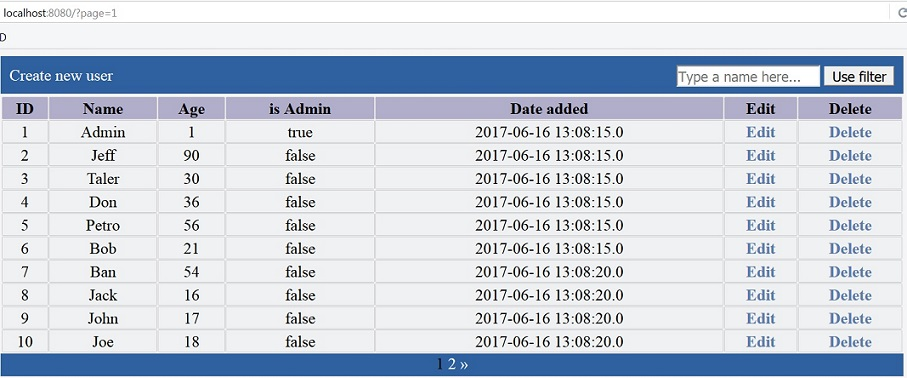

# CRUD

**Simple CRUD (Create, Read, Update and Delete) web-application with filter (by name) and pagination**

Technologies:
  * backend: Spring, Hibernate
  * frontend: Spring MVC, HTML5, CSS3

Tested on:
 * server: Apache Tomcat 9 (9.0.0.M21)
 * database: MySQL 5.6
 
To deploy application through the command line, use the command: **mvn tomcat7:deploy**

[Script for creating and filling a database](docs/database.sql)

[The task itself (on russian)](docs/TestTask.pdf)

